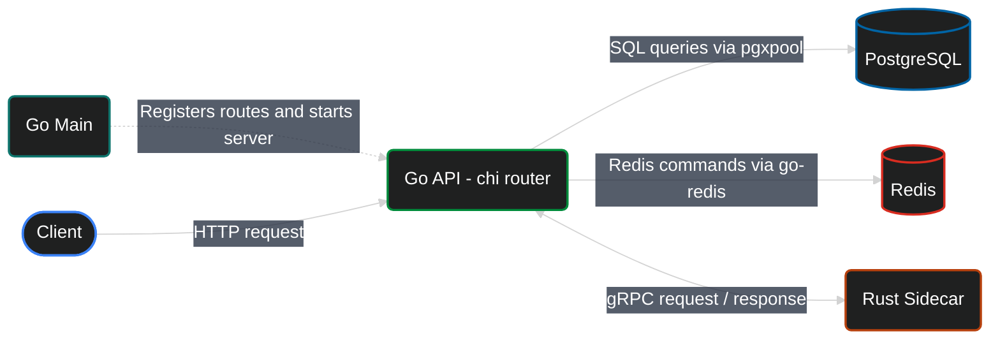

```mermaid
%%{init: {
  'theme': 'dark',
  'themeVariables': {
    'edgeLabelBackground': '#1e293b80',
    'textColor': '#ffffff'
  }
}}%%
flowchart LR
    Main("Go Main")
    API("Go API - chi router")
    Client(["Client"])
    Redis[("Redis")]
    Database[("PostgreSQL")]
    Rust("Rust Sidecar")

    Main -.->|"Registers routes and starts server"| API
    Client -->|"HTTP request"| API
    API -->|"SQL queries via pgxpool"| Database
    API -->|"Redis commands via go-redis"| Redis
    API <-->|"gRPC request / response"| Rust

    style Main stroke:#0F766E,stroke-width:2px
    style API stroke:#008A3B,stroke-width:2px
    style Client stroke:#3B82F6,stroke-width:2px
    style Database stroke:#0064a5,stroke-width:2px
    style Redis stroke:#D82C20,stroke-width:2px
    style Rust stroke:#B7410E,stroke-width:2px
```

