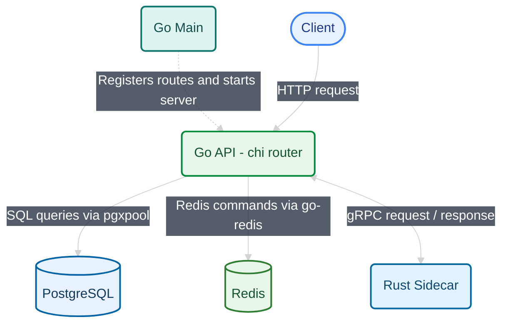

```mermaid
%%{init: {
  'theme': 'dark',
  'themeVariables': {
    'edgeLabelBackground': '#1e293b80',
    'textColor': '#ffffff'
  }
}}%%
flowchart TB;
    Main("Go Main")
    API("Go API - chi router")
    Client(["Client"])
    Redis[("Redis")]
    Database[("PostgreSQL")]
    Rust("Rust Sidecar")

    Main -.->|"Registers routes and starts server"| API
    Client -->|"HTTP request"| API
    API -->|"SQL queries via pgxpool"| Database
    API -->|"Redis commands via go-redis"| Redis
    API <-->|"gRPC request / response"| Rust

    style Main fill:#DDF4F0,stroke:#0F766E,color:#134E4A,stroke-width:2px
    style API fill:#E8F5E9,stroke:#008A3B,color:#14532D,stroke-width:2px
    style Client fill:#E8F1FF,stroke:#3B82F6,color:#1E3A8A,stroke-width:2px
    style Database fill:#E8F1FF,stroke:#0064A5,color:#123B5D,stroke-width:2px
    style Redis fill:#E8F5E9,stroke:#2E7D32,color:#14532D,stroke-width:2px
    style Rust fill:#E0F2FE,stroke:#0369A1,color:#0C4A6E,stroke-width:2px
```

