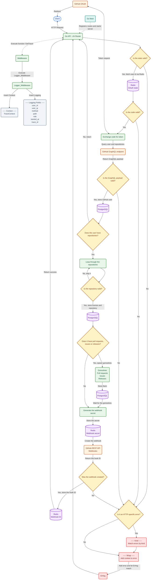

```mermaid
flowchart TB;
    GitHub("GitHub OAuth")
    Main("Go Main")
    API("Go API - chi Router")
    Middleware("Middleware")
    LoggingMiddleware("Logger_Middleware")
    TraceContext("----- Context ----- \nTraceContext")
    ZeroLogger("----- Logging Fields ----- \nuser_id \nuser_ip \nmethod \npath \nrole \nstarted_at \ntrace_id")
    Client(["Client"])
    RedisState[("Redis \nOAuth state")]
    StateValid{"Is the state valid?"}
    CodeValid{"Is the code valid?"}
    Exchange("Exchange code for token")
    GitHubGraph("GitHub GraphQL endpoint")
    GraphValid{"Is the GraphQL payload valid?"}
    DatabaseUser[("PostgreSQL")]
    RepoCount{"Does the user have repositories?"}
    StoreRepositories("Loop through the repositories")
    RepoValid{"Is the repository valid?"}
    DatabaseRepo[("PostgreSQL")]
    RepoSubValid{"Does it have pull requests, issues or releases?"}
    Goroutines("Goroutines \nPull requests \nIssues \nReleases")
    DatabaseSync[("PostgreSQL")]
    WebhookSecret("Generate the webhook secret")
    RedisSecret[("Redis \nWebhook secret")]
    GitHubHooks("GitHub REST API \nWebhooks")
    HookCreated{"Was the webhook created?"}
    RedisHook[("Redis \nWebhook ID")]
    Wrap("----- Wrap ----- \nAdd context to error")
    Kind("----- Kind ----- \nMatch errors by kind")
    Errlog("Errlog")
    HTTPError{"Is it an HTTP-specific error?"}

    Main-.->|"Registers routes and starts server"|API
    GitHub-->|"Redirect"|Client
    Client<-->|"HTTP Request"|API
    API<-.->|"Execute function 'GetTrace'"|Middleware
    Middleware-->|"Execute Logger_Middleware"|LoggingMiddleware
    LoggingMiddleware-->|"Insert Context"|TraceContext
    LoggingMiddleware-->|"Insert Logging"|ZeroLogger
    API-->StateValid
    StateValid-->|"No"|HTTPError
    StateValid-->|"Yes, fetch user id via Redis"|RedisState
    RedisState-->CodeValid
    CodeValid-->|"No"|HTTPError
    CodeValid-->|"Yes"|Exchange
    Exchange<-->|"Token request"|GitHub
    Exchange-->|"Query user and repositories"|GitHubGraph
    GitHubGraph-->|"Return GraphQL payload"|GraphValid
    GraphValid-->|"No"|HTTPError
    GraphValid-->|"Yes, store GitHub user"|DatabaseUser
    DatabaseUser-->RepoCount
    RepoCount-->|"No, return"|API
    RepoCount-->|"Yes"|StoreRepositories
    StoreRepositories-->RepoValid
    RepoValid-->|"No, skip it"|StoreRepositories
    RepoValid-->|"Yes, store license and repository"|DatabaseRepo
    DatabaseRepo-->RepoSubValid
    RepoSubValid-->|"Yes, spawn goroutines"|Goroutines
    Goroutines-->|"Store them"|DatabaseSync
    DatabaseSync-->|"Wait for the goroutines"|WebhookSecret
    RepoSubValid-->|"No"|WebhookSecret
    WebhookSecret-->|"Store the secret"|RedisSecret
    RedisSecret-->|"Create the webhook"|GitHubHooks
    GitHubHooks-->|"Return the hook ID"|HookCreated
    HookCreated-->|"No"|HTTPError
    HookCreated-->|"Yes, store the hook ID"|RedisHook
    RedisHook-->|"Return success"|API
    HTTPError-->|"Yes"|Kind-->Wrap
    HTTPError-->|"No"|Wrap
    Wrap-->|"Add error and let Errlog match"|Errlog
    Errlog-->API

    style Client fill:#E8F1FF,stroke:#3B82F6,color:#1E3A8A,stroke-width:2px
    style Main fill:#DDF4F0,stroke:#0F766E,color:#134E4A,stroke-width:2px

    style API fill:#E8F5E9,stroke:#2E7D32,color:#14532D,stroke-width:2px
    style Middleware fill:#E8F5E9,stroke:#2E7D32,color:#14532D,stroke-width:2px
    style LoggingMiddleware fill:#E8F5E9,stroke:#2E7D32,color:#14532D,stroke-width:2px
    style Exchange fill:#E8F5E9,stroke:#2E7D32,color:#14532D,stroke-width:2px
    style StoreRepositories fill:#E8F5E9,stroke:#2E7D32,color:#14532D,stroke-width:2px
    style Goroutines fill:#E8F5E9,stroke:#2E7D32,color:#14532D,stroke-width:2px
    style WebhookSecret fill:#E8F5E9,stroke:#2E7D32,color:#14532D,stroke-width:2px

    style RedisState fill:#F3E8FF,stroke:#7E22CE,color:#581C87,stroke-width:2px
    style RedisSecret fill:#F3E8FF,stroke:#7E22CE,color:#581C87,stroke-width:2px
    style RedisHook fill:#F3E8FF,stroke:#7E22CE,color:#581C87,stroke-width:2px
    style DatabaseUser fill:#F3E8FF,stroke:#7E22CE,color:#581C87,stroke-width:2px
    style DatabaseRepo fill:#F3E8FF,stroke:#7E22CE,color:#581C87,stroke-width:2px
    style DatabaseSync fill:#F3E8FF,stroke:#7E22CE,color:#581C87,stroke-width:2px

    style GitHub fill:#FFF3E0,stroke:#C2410C,color:#7C2D12,stroke-width:2px
    style GitHubGraph fill:#FFF3E0,stroke:#C2410C,color:#7C2D12,stroke-width:2px
    style GitHubHooks fill:#FFF3E0,stroke:#C2410C,color:#7C2D12,stroke-width:2px

    style Wrap fill:#FEE2E2,stroke:#DC2626,color:#7F1D1D,stroke-width:2px
    style Kind fill:#FEE2E2,stroke:#DC2626,color:#7F1D1D,stroke-width:2px
    style Errlog fill:#FEE2E2,stroke:#DC2626,color:#7F1D1D,stroke-width:2px

    style TraceContext fill:#F1F5F9,stroke:#64748B,color:#334155,stroke-width:2px
    style ZeroLogger fill:#F1F5F9,stroke:#64748B,color:#334155,stroke-width:2px

    style StateValid fill:#FEF3C7,stroke:#B45309,color:#78350F,stroke-width:2px
    style CodeValid fill:#FEF3C7,stroke:#B45309,color:#78350F,stroke-width:2px
    style GraphValid fill:#FEF3C7,stroke:#B45309,color:#78350F,stroke-width:2px
    style RepoCount fill:#FEF3C7,stroke:#B45309,color:#78350F,stroke-width:2px
    style RepoValid fill:#FEF3C7,stroke:#B45309,color:#78350F,stroke-width:2px
    style RepoSubValid fill:#FEF3C7,stroke:#B45309,color:#78350F,stroke-width:2px
    style HookCreated fill:#FEF3C7,stroke:#B45309,color:#78350F,stroke-width:2px
    style HTTPError fill:#FEF3C7,stroke:#B45309,color:#78350F,stroke-width:2px
```