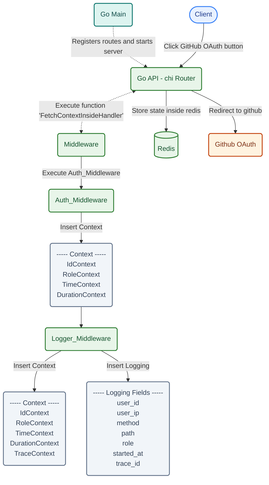

```mermaid
flowchart TB;
    Main("Go Main")
    API("Go API - chi Router")
    Middleware("Middleware")
    AuthMiddleware("Auth_Middleware")
    LoggingMiddleware("Logger_Middleware")
    Context1("----- Context ----- \nIdContext \nRoleContext \nTimeContext \nDurationContext")
    Context2("----- Context ----- \nIdContext \nRoleContext \nTimeContext \nDurationContext \nTraceContext")
    ZeroLogger("----- Logging Fields ----- \nuser_id \nuser_ip \nmethod \npath \nrole \nstarted_at \ntrace_id")
    Client(["Client"])
    Redis[("Redis")]
    GitHub("Github OAuth")

    Main-.->|"Registers routes and starts server"|API
    Client-->|"Click GitHub OAuth button"|API
    API<-.->|"Execute function 'FetchContextInsideHandler'"|Middleware
    Middleware-->|"Execute Auth_Middleware"|AuthMiddleware
    AuthMiddleware-->|"Insert Context"|Context1-->LoggingMiddleware-->|"Insert Context"|Context2
    LoggingMiddleware-->|"Insert Logging"|ZeroLogger
    API-->|"Store state inside redis"|Redis
    API-->|"Redirect to github"|GitHub

    style Client fill:#E8F1FF,stroke:#3B82F6,color:#1E3A8A,stroke-width:2px
    style Main fill:#DDF4F0,stroke:#0F766E,color:#134E4A,stroke-width:2px

    style API fill:#E8F5E9,stroke:#2E7D32,color:#14532D,stroke-width:2px
    style Middleware fill:#E8F5E9,stroke:#2E7D32,color:#14532D,stroke-width:2px
    style AuthMiddleware fill:#E8F5E9,stroke:#2E7D32,color:#14532D,stroke-width:2px
    style LoggingMiddleware fill:#E8F5E9,stroke:#2E7D32,color:#14532D,stroke-width:2px
    style Redis fill:#E8F5E9,stroke:#2E7D32,color:#14532D,stroke-width:2px

    style GitHub fill:#FFF3E0,stroke:#C2410C,color:#7C2D12,stroke-width:2px

    style Context1 fill:#F1F5F9,stroke:#64748B,color:#334155,stroke-width:2px
    style Context2 fill:#F1F5F9,stroke:#64748B,color:#334155,stroke-width:2px
    style ZeroLogger fill:#F1F5F9,stroke:#64748B,color:#334155,stroke-width:2px
```