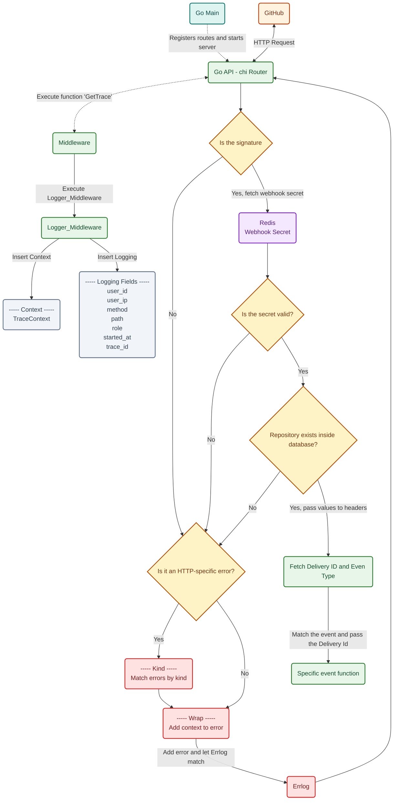

```mermaid
flowchart TB;
    GitHub("GitHub")
    Main("Go Main")
    API("Go API - chi Router")
    Middleware("Middleware")
    LoggingMiddleware("Logger_Middleware")
    TraceContext("----- Context ----- \nTraceContext")
    ZeroLogger("----- Logging Fields ----- \nuser_id \nuser_ip \nmethod \npath \nrole \nstarted_at \ntrace_id")
    SignatureValid{"Is the signature"}
    Wrap("----- Wrap ----- \nAdd context to error")
    Kind("----- Kind ----- \nMatch errors by kind")
    Errlog("Errlog")
    HTTPError{"Is it an HTTP-specific error?"}
    RedisSecret("Redis \nWebhook Secret")
    SecretValid{"Is the secret valid?"}
    RepositoryExists{"Repository exists inside database?"}
    DeliveryAndType("Fetch Delivery ID and Even Type")
    Continue("Specific event function")


    Main-.->|"Registers routes and starts server"|API
    GitHub<-->|"HTTP Request"|API
    API<-.->|"Execute function 'GetTrace'"|Middleware
    Middleware-->|"Execute Logger_Middleware"|LoggingMiddleware
    LoggingMiddleware-->|"Insert Context"|TraceContext
    LoggingMiddleware-->|"Insert Logging"|ZeroLogger
    API-->SignatureValid
    SignatureValid-->|"No"|HTTPError
    HTTPError-->|"Yes"|Kind-->Wrap
    HTTPError-->|"No"|Wrap
    Wrap-->|"Add error and let Errlog match"|Errlog
    Errlog-->API
    SignatureValid-->|"Yes, fetch webhook secret"|RedisSecret-->SecretValid
    SecretValid-->|"No"|HTTPError
    SecretValid-->|"Yes"|RepositoryExists
    RepositoryExists-->|"No"|HTTPError
    RepositoryExists-->|"Yes, pass values to headers"|DeliveryAndType
    DeliveryAndType-->|"Match the event and pass the Delivery Id"|Continue

    style Main fill:#DDF4F0,stroke:#0F766E,color:#134E4A,stroke-width:2px

    style GitHub fill:#FFF3E0,stroke:#C2410C,color:#7C2D12,stroke-width:2px

    style API fill:#E8F5E9,stroke:#2E7D32,color:#14532D,stroke-width:2px
    style Middleware fill:#E8F5E9,stroke:#2E7D32,color:#14532D,stroke-width:2px
    style LoggingMiddleware fill:#E8F5E9,stroke:#2E7D32,color:#14532D,stroke-width:2px
    style DeliveryAndType fill:#E8F5E9,stroke:#2E7D32,color:#14532D,stroke-width:2px
    style Continue fill:#E8F5E9,stroke:#2E7D32,color:#14532D,stroke-width:2px

    style RedisSecret fill:#F3E8FF,stroke:#7E22CE,color:#581C87,stroke-width:2px

    style Wrap fill:#FEE2E2,stroke:#DC2626,color:#7F1D1D,stroke-width:2px
    style Kind fill:#FEE2E2,stroke:#DC2626,color:#7F1D1D,stroke-width:2px
    style Errlog fill:#FEE2E2,stroke:#DC2626,color:#7F1D1D,stroke-width:2px

    style TraceContext fill:#F1F5F9,stroke:#64748B,color:#334155,stroke-width:2px
    style ZeroLogger fill:#F1F5F9,stroke:#64748B,color:#334155,stroke-width:2px

    style SignatureValid fill:#FEF3C7,stroke:#B45309,color:#78350F,stroke-width:2px
    style SecretValid fill:#FEF3C7,stroke:#B45309,color:#78350F,stroke-width:2px
    style RepositoryExists fill:#FEF3C7,stroke:#B45309,color:#78350F,stroke-width:2px
    style HTTPError fill:#FEF3C7,stroke:#B45309,color:#78350F,stroke-width:2px
```