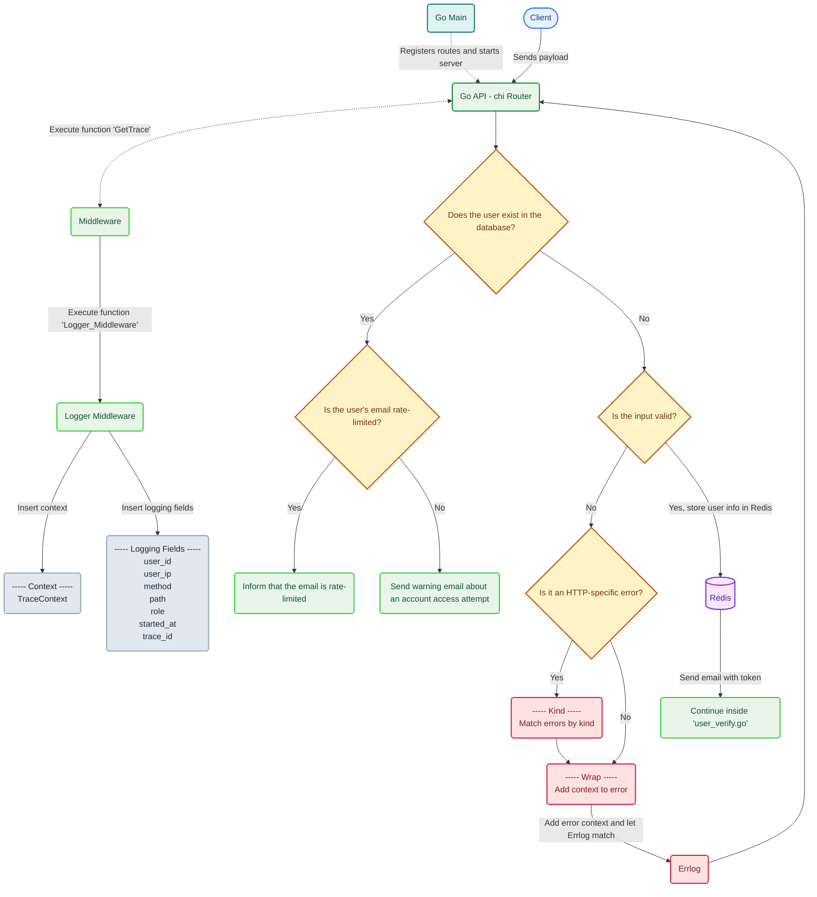

```mermaid
flowchart TB;
    Main("Go Main")
    API("Go API - chi Router")
    Middleware("Middleware")
    Context2("----- Context ----- \nTraceContext")
    ZeroLogger("----- Logging Fields ----- \nuser_id \nuser_ip \nmethod \npath \nrole \nstarted_at \ntrace_id")
    LoggingMiddleware("Logger Middleware")
    Client(["Client"])
    UserExists{"Does the user exist in the database?"}
    RateLimited{"Is the user's email rate-limited?"}
    SendWarningEmail("Send warning email about an account access attempt")
    SendRateLimit("Inform that the email is rate-limited")
    Redis[("Redis")]
    Wrap("----- Wrap ----- \nAdd context to error")
    Kind("----- Kind ----- \nMatch errors by kind")
    Errlog("Errlog")
    HTTPError{"Is it an HTTP-specific error?"}
    Validation{"Is the input valid?"}
    Continuation("Continue inside 'user_verify.go'")

    Main-.->|"Registers routes and starts server"|API
    Client-->|"Sends payload"|API
    API<-.->|"Execute function 'GetTrace'"|Middleware
    Middleware-->|"Execute function 'Logger_Middleware'"|LoggingMiddleware
    LoggingMiddleware-->|"Insert context"|Context2
    LoggingMiddleware-->|"Insert logging fields"|ZeroLogger
    API-->UserExists
    UserExists-->|"Yes"|RateLimited
    RateLimited-->|"Yes"|SendRateLimit
    RateLimited-->|"No"|SendWarningEmail
    UserExists-->|"No"|Validation
    Validation-->|"No"|HTTPError
    HTTPError-->|"Yes"|Kind-->Wrap
    HTTPError-->|"No"|Wrap
    Wrap-->|"Add error context and let Errlog match"|Errlog
    Errlog-->API
    Validation-->|"Yes, store user info in Redis"|Redis-->|"Send email with token"|Continuation

    style Main fill:#DDF4F0,stroke:#0F766E,color:#134E4A,stroke-width:2px
    style API fill:#E8F5E9,stroke:#008A3B,color:#14532D,stroke-width:2px
    style Client fill:#E8F1FF,stroke:#3B82F6,color:#1E3A8A,stroke-width:2px
    style Redis fill:#F3E8FF,stroke:#7E22CE,color:#581C87,stroke-width:2px

    style Middleware fill:#E8F5E9,stroke:#32CD32,color:#14532D,stroke-width:2px
    style LoggingMiddleware fill:#E8F5E9,stroke:#32CD32,color:#14532D,stroke-width:2px
    style SendWarningEmail fill:#E8F5E9,stroke:#32CD32,color:#14532D,stroke-width:2px
    style SendRateLimit fill:#E8F5E9,stroke:#32CD32,color:#14532D,stroke-width:2px
    style Continuation fill:#E8F5E9,stroke:#32CD32,color:#14532D,stroke-width:2px

    style Context2 fill:#E2E8F0,stroke:#94A3B8,color:#1E293B,stroke-width:2px
    style ZeroLogger fill:#E2E8F0,stroke:#94A3B8,color:#1E293B,stroke-width:2px
    style Validation fill:#FEF3C7,stroke:#B45309,color:#78350F,stroke-width:2px
    style UserExists fill:#FEF3C7,stroke:#B45309,color:#78350F,stroke-width:2px
    style RateLimited fill:#FEF3C7,stroke:#B45309,color:#78350F,stroke-width:2px
    style HTTPError fill:#FEF3C7,stroke:#B45309,color:#78350F,stroke-width:2px

    style Wrap fill:#FEE2E2,stroke:#DC143C,color:#7F1D1D,stroke-width:2px
    style Kind fill:#FEE2E2,stroke:#DC143C,color:#7F1D1D,stroke-width:2px
    style Errlog fill:#FEE2E2,stroke:#DC143C,color:#7F1D1D,stroke-width:2px
```