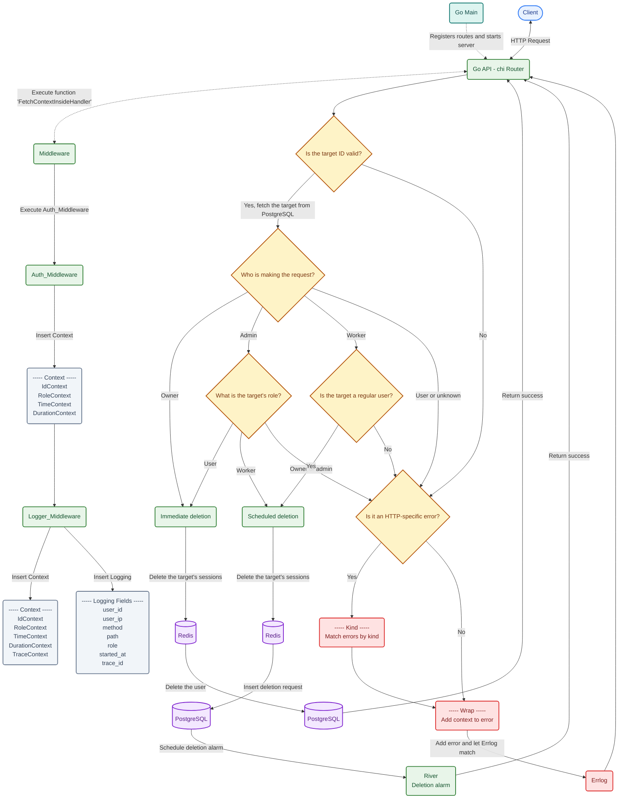

```mermaid
flowchart TB;
    Main("Go Main")
    API("Go API - chi Router")
    Middleware("Middleware")
    AuthMiddleware("Auth_Middleware")
    LoggingMiddleware("Logger_Middleware")
    Context1("----- Context ----- \nIdContext \nRoleContext \nTimeContext \nDurationContext")
    Context2("----- Context ----- \nIdContext \nRoleContext \nTimeContext \nDurationContext \nTraceContext")
    ZeroLogger("----- Logging Fields ----- \nuser_id \nuser_ip \nmethod \npath \nrole \nstarted_at \ntrace_id")
    Client(["Client"])
    Validation{"Is the target ID valid?"}
    Role{"Who is making the request?"}
    AdminTarget{"What is the target's role?"}
    WorkerTarget{"Is the target a regular user?"}
    Instant("Immediate deletion")
    Scheduled("Scheduled deletion")
    RedisInstant[("Redis")]
    RedisScheduled[("Redis")]
    DatabaseDelete[("PostgreSQL")]
    DatabaseRequest[("PostgreSQL")]
    River("River \nDeletion alarm")
    Wrap("----- Wrap ----- \nAdd context to error")
    Kind("----- Kind ----- \nMatch errors by kind")
    Errlog("Errlog")
    HTTPError{"Is it an HTTP-specific error?"}

    Main-.->|"Registers routes and starts server"|API
    Client<-->|"HTTP Request"|API
    API<-.->|"Execute function 'FetchContextInsideHandler'"|Middleware
    Middleware-->|"Execute Auth_Middleware"|AuthMiddleware
    AuthMiddleware-->|"Insert Context"|Context1-->LoggingMiddleware-->|"Insert Context"|Context2
    LoggingMiddleware-->|"Insert Logging"|ZeroLogger
    API-->Validation
    Validation-->|"Yes, fetch the target from PostgreSQL"|Role
    Role-->|"Owner"|Instant
    Role-->|"Admin"|AdminTarget
    Role-->|"Worker"|WorkerTarget
    Role-->|"User or unknown"|HTTPError
    AdminTarget-->|"User"|Instant
    AdminTarget-->|"Worker"|Scheduled
    AdminTarget-->|"Owner or admin"|HTTPError
    WorkerTarget-->|"Yes"|Scheduled
    WorkerTarget-->|"No"|HTTPError
    Instant-->|"Delete the target's sessions"|RedisInstant
    RedisInstant-->|"Delete the user"|DatabaseDelete
    DatabaseDelete-->|"Return success"|API
    Scheduled-->|"Delete the target's sessions"|RedisScheduled
    RedisScheduled-->|"Insert deletion request"|DatabaseRequest
    DatabaseRequest-->|"Schedule deletion alarm"|River
    River-->|"Return success"|API
    Validation-->|"No"|HTTPError
    HTTPError-->|"Yes"|Kind-->Wrap
    HTTPError-->|"No"|Wrap
    Wrap-->|"Add error and let Errlog match"|Errlog
    Errlog-->API

    style Client fill:#E8F1FF,stroke:#3B82F6,color:#1E3A8A,stroke-width:2px
    style Main fill:#DDF4F0,stroke:#0F766E,color:#134E4A,stroke-width:2px

    style API fill:#E8F5E9,stroke:#2E7D32,color:#14532D,stroke-width:2px
    style Middleware fill:#E8F5E9,stroke:#2E7D32,color:#14532D,stroke-width:2px
    style AuthMiddleware fill:#E8F5E9,stroke:#2E7D32,color:#14532D,stroke-width:2px
    style LoggingMiddleware fill:#E8F5E9,stroke:#2E7D32,color:#14532D,stroke-width:2px
    style Instant fill:#E8F5E9,stroke:#2E7D32,color:#14532D,stroke-width:2px
    style Scheduled fill:#E8F5E9,stroke:#2E7D32,color:#14532D,stroke-width:2px
    style River fill:#E8F5E9,stroke:#2E7D32,color:#14532D,stroke-width:2px

    style RedisInstant fill:#F3E8FF,stroke:#7E22CE,color:#581C87,stroke-width:2px
    style RedisScheduled fill:#F3E8FF,stroke:#7E22CE,color:#581C87,stroke-width:2px
    style DatabaseDelete fill:#F3E8FF,stroke:#7E22CE,color:#581C87,stroke-width:2px
    style DatabaseRequest fill:#F3E8FF,stroke:#7E22CE,color:#581C87,stroke-width:2px

    style Wrap fill:#FEE2E2,stroke:#DC2626,color:#7F1D1D,stroke-width:2px
    style Kind fill:#FEE2E2,stroke:#DC2626,color:#7F1D1D,stroke-width:2px
    style Errlog fill:#FEE2E2,stroke:#DC2626,color:#7F1D1D,stroke-width:2px

    style Context1 fill:#F1F5F9,stroke:#64748B,color:#334155,stroke-width:2px
    style Context2 fill:#F1F5F9,stroke:#64748B,color:#334155,stroke-width:2px
    style ZeroLogger fill:#F1F5F9,stroke:#64748B,color:#334155,stroke-width:2px

    style Validation fill:#FEF3C7,stroke:#B45309,color:#78350F,stroke-width:2px
    style Role fill:#FEF3C7,stroke:#B45309,color:#78350F,stroke-width:2px
    style AdminTarget fill:#FEF3C7,stroke:#B45309,color:#78350F,stroke-width:2px
    style WorkerTarget fill:#FEF3C7,stroke:#B45309,color:#78350F,stroke-width:2px
    style HTTPError fill:#FEF3C7,stroke:#B45309,color:#78350F,stroke-width:2px
```