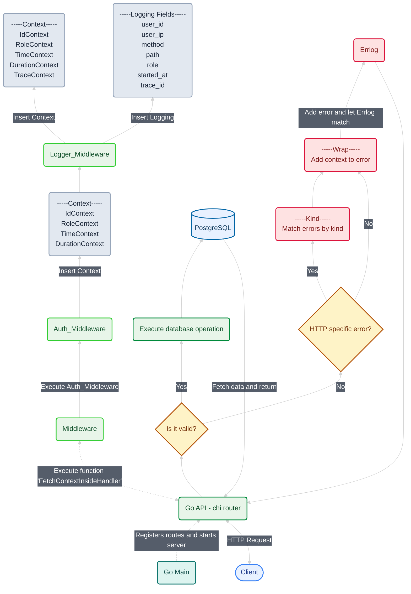

```mermaid
%%{init: {
  'theme': 'dark',
  'themeVariables': {
    'edgeLabelBackground': '#1e293b80',
    'textColor': '#ffffff'
  }
}}%%
flowchart BT;
    Main("Go Main")
    API("Go API - chi router")
    Middleware("Middleware")
    AuthMiddleware("Auth_Middleware")
    Context1("-----Context----- \nIdContext \nRoleContext \nTimeContext \nDurationContext")
    Context2("-----Context----- \nIdContext \nRoleContext \nTimeContext \nDurationContext \nTraceContext")
    ZeroLogger("-----Logging Fields----- \nuser_id \nuser_ip \nmethod \npath \nrole \nstarted_at \ntrace_id")
    LoggingMiddleware("Logger_Middleware")
    Client(["Client"])
    Database[("PostgreSQL")]
    DbOperation("Execute database operation")
    Wrap("-----Wrap----- \nAdd context to error")
    Kind("-----Kind----- \nMatch errors by kind")
    Errlog("Errlog")
    HTTPError{"HTTP specific error?"}
    Validation{"Is it valid?"}

    Main-.->|"Registers routes and starts server"|API
    Client<-->|"HTTP Request"|API
    API<-.->|"Execute function 'FetchContextInsideHandler'"|Middleware
    Middleware-->|"Execute Auth_Middleware"|AuthMiddleware
    AuthMiddleware-->|"Insert Context"|Context1-->LoggingMiddleware-->|"Insert Context"|Context2
    LoggingMiddleware-->|"Insert Logging"|ZeroLogger
    API-->Validation
    Validation-->|"Yes"|DbOperation
    DbOperation-->Database-->|"Fetch data and return"|API
    Validation-->|"No"|HTTPError
    HTTPError-->|"Yes"|Kind-->Wrap
    HTTPError-->|"No"|Wrap
    Wrap-->|"Add error and let Errlog match"|Errlog
    Errlog-->API


    style Main fill:#DDF4F0,stroke:#0F766E,color:#134E4A,stroke-width:2px
    style API fill:#E8F5E9,stroke:#008A3B,color:#14532D,stroke-width:2px
    style Client fill:#E8F1FF,stroke:#3B82F6,color:#1E3A8A,stroke-width:2px

    style Middleware fill:#E8F5E9,stroke:#32CD32,color:#14532D,stroke-width:2px
    style AuthMiddleware fill:#E8F5E9,stroke:#32CD32,color:#14532D,stroke-width:2px
    style LoggingMiddleware fill:#E8F5E9,stroke:#32CD32,color:#14532D,stroke-width:2px

    style Context1 fill:#E2E8F0,stroke:#94A3B8,color:#1E293B,stroke-width:2px
    style Context2 fill:#E2E8F0,stroke:#94A3B8,color:#1E293B,stroke-width:2px
    style ZeroLogger fill:#E2E8F0,stroke:#94A3B8,color:#1E293B,stroke-width:2px
    style Validation fill:#FEF3C7,stroke:#B45309,color:#78350F,stroke-width:2px
    style HTTPError fill:#FEF3C7,stroke:#B45309,color:#78350F,stroke-width:2px
    style DbOperation fill:#E8F5E9,stroke:#008A3B,color:#14532D,stroke-width:2px
    style Database fill:#E8F1FF,stroke:#0064A5,color:#123B5D,stroke-width:2px

    style Wrap fill:#FEE2E2,stroke:#DC143C,color:#7F1D1D,stroke-width:2px
    style Kind fill:#FEE2E2,stroke:#DC143C,color:#7F1D1D,stroke-width:2px
    style Errlog fill:#FEE2E2,stroke:#DC143C,color:#7F1D1D,stroke-width:2px
```