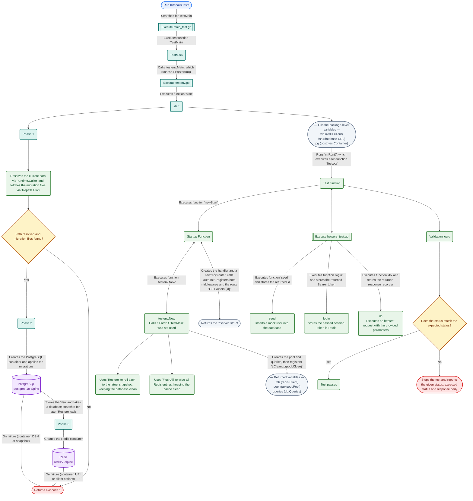

```mermaid
flowchart TB;
    Database[("PostgreSQL \npostgres:18-alpine")]
    Redis[("Redis \nredis:7-alpine")]
    Execute(["Run Kitanai's tests"])
    ExecuteMain[["Execute main_test.go"]]
    ExecuteTE[["Execute testenv.go"]]
    ExecuteHT[["Execute helpers_test.go"]]
    MainTest("TestMain")
    Start("start")
    Phase1("Phase 1")
    Phase1Fetch("Resolves the current path via 'runtime.Caller' and fetches the migration files via 'filepath.Glob'")
    Found{"Path resolved and migration files found?"}
    ReturnExitCode(["Returns exit code 1"])
    Phase2("Phase 2")
    Phase3("Phase 3")
    InsertValue(["--- Fills the package-level variables ---\nrdb (redis.Client) \ndsn (database URL) \npg (postgres.Container)"])
    Test("Test function")
    NewServer("Startup Function")
    TestEnvNew("testenv.New\nCalls 't.Fatal' if 'TestMain' was not used")
    TestEnvNewSnapshot("Uses 'Restore' to roll back to the latest snapshot, keeping the database clean")
    TestEnvNewFlushAll("Uses 'FlushAll' to wipe all Redis entries, keeping the cache clean")
    TestEnvNewReturn(["--- Returned variables --- \nrdb (redis.Client) \npool (pgxpool.Pool) \nqueries (db.Queries)"])
    NewServerReturn(["Returns the '*Server' struct"])
    Seed("seed\nInserts a mock user into the database")
    Login("login\nStores the hashed session token in Redis")
    Do("do\nExecutes an httptest request with the provided parameters")
    Validation("Validation logic")
    Status{"Does the status match the expected status?"}
    Pass("Test passes")
    Fatalf(["Stops the test and reports the given status, expected status and response body"])

    Execute-->|"Searches for TestMain"|ExecuteMain
    ExecuteMain-->|"Executes function 'TestMain'"|MainTest
    MainTest-->|"Calls 'testenv.Main', which runs 'os.Exit(start(m))'"|ExecuteTE
    ExecuteTE-->|"Executes function 'start'"|Start
    Start-->Phase1
    Phase1-->Phase1Fetch
    Phase1Fetch-->Found
    Found-->|"Yes"|Phase2
    Found-->|"No"|ReturnExitCode
    Phase2-->|"Creates the PostgreSQL container and applies the migrations"|Database
    Database-->|"On failure (container, DSN or snapshot)"|ReturnExitCode
    Database-->|"Stores the 'dsn' and takes a database snapshot for later 'Restore' calls"|Phase3
    Phase3-->|"Creates the Redis container"|Redis
    Redis-->|"On failure (container, URI or client options)"|ReturnExitCode
    Start-->InsertValue-->|"Runs 'm.Run()', which executes each function 'Testxxx'"|Test
    Test-->|"Executes function 'newStart'"|NewServer
    NewServer<-->|"Executes function 'testenv.New'"|TestEnvNew
    TestEnvNew-->TestEnvNewSnapshot
    TestEnvNew-->TestEnvNewFlushAll
    TestEnvNew-->|"Creates the pool and queries, then registers 't.Cleanup(pool.Close)'"|TestEnvNewReturn
    NewServer<-->|"Creates the handler and a new 'chi' router, calls 'auth.Init', registers both middlewares and the route 'GET /users/{id}'"|NewServerReturn
    Test<-->ExecuteHT
    ExecuteHT-->|"Executes function 'seed' and stores the returned id"|Seed
    ExecuteHT-->|"Executes function 'login' and stores the returned Bearer token"|Login
    ExecuteHT-->|"Executes function 'do' and stores the returned response recorder"|Do
    Test-->Validation
    Validation-->Status
    Status-->|"Yes"|Pass
    Status-->|"No"|Fatalf

    style Execute fill:#E8F1FF,stroke:#3B82F6,color:#1E3A8A,stroke-width:2px

    style ExecuteMain fill:#DDF4F0,stroke:#0F766E,color:#134E4A,stroke-width:2px
    style ExecuteTE fill:#DDF4F0,stroke:#0F766E,color:#134E4A,stroke-width:2px
    style MainTest fill:#DDF4F0,stroke:#0F766E,color:#134E4A,stroke-width:2px
    style Start fill:#DDF4F0,stroke:#0F766E,color:#134E4A,stroke-width:2px
    style Phase1 fill:#DDF4F0,stroke:#0F766E,color:#134E4A,stroke-width:2px
    style Phase2 fill:#DDF4F0,stroke:#0F766E,color:#134E4A,stroke-width:2px
    style Phase3 fill:#DDF4F0,stroke:#0F766E,color:#134E4A,stroke-width:2px

    style Phase1Fetch fill:#E8F5E9,stroke:#2E7D32,color:#14532D,stroke-width:2px
    style ExecuteHT fill:#E8F5E9,stroke:#2E7D32,color:#14532D,stroke-width:2px
    style Test fill:#E8F5E9,stroke:#2E7D32,color:#14532D,stroke-width:2px
    style NewServer fill:#E8F5E9,stroke:#2E7D32,color:#14532D,stroke-width:2px
    style TestEnvNew fill:#E8F5E9,stroke:#2E7D32,color:#14532D,stroke-width:2px
    style TestEnvNewSnapshot fill:#E8F5E9,stroke:#2E7D32,color:#14532D,stroke-width:2px
    style TestEnvNewFlushAll fill:#E8F5E9,stroke:#2E7D32,color:#14532D,stroke-width:2px
    style Seed fill:#E8F5E9,stroke:#2E7D32,color:#14532D,stroke-width:2px
    style Login fill:#E8F5E9,stroke:#2E7D32,color:#14532D,stroke-width:2px
    style Do fill:#E8F5E9,stroke:#2E7D32,color:#14532D,stroke-width:2px
    style Validation fill:#E8F5E9,stroke:#2E7D32,color:#14532D,stroke-width:2px
    style Pass fill:#E8F5E9,stroke:#2E7D32,color:#14532D,stroke-width:2px

    style Database fill:#F3E8FF,stroke:#7E22CE,color:#581C87,stroke-width:2px
    style Redis fill:#F3E8FF,stroke:#7E22CE,color:#581C87,stroke-width:2px

    style ReturnExitCode fill:#FEE2E2,stroke:#DC2626,color:#7F1D1D,stroke-width:2px
    style Fatalf fill:#FEE2E2,stroke:#DC2626,color:#7F1D1D,stroke-width:2px

    style InsertValue fill:#F1F5F9,stroke:#64748B,color:#334155,stroke-width:2px
    style TestEnvNewReturn fill:#F1F5F9,stroke:#64748B,color:#334155,stroke-width:2px
    style NewServerReturn fill:#F1F5F9,stroke:#64748B,color:#334155,stroke-width:2px

    style Found fill:#FEF3C7,stroke:#B45309,color:#78350F,stroke-width:2px
    style Status fill:#FEF3C7,stroke:#B45309,color:#78350F,stroke-width:2px
```
