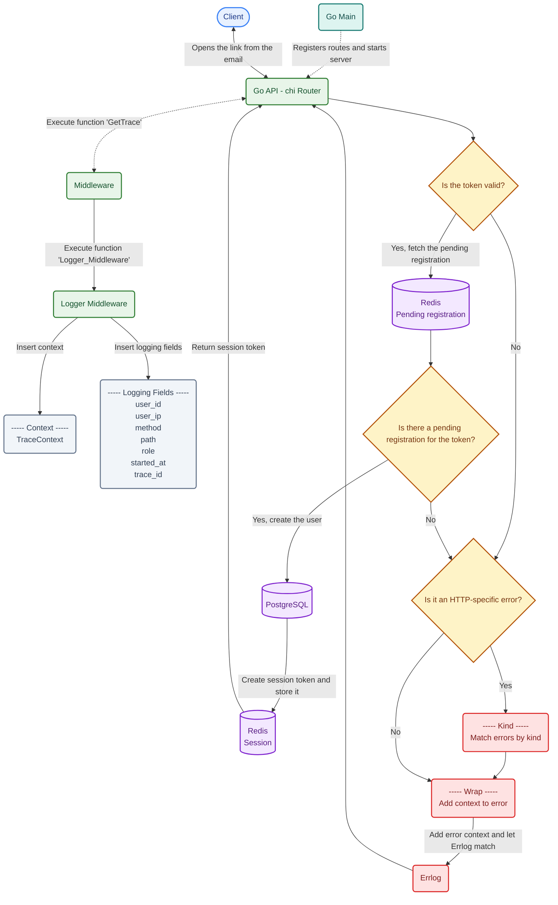

```mermaid
flowchart TB;
    Main("Go Main")
    API("Go API - chi Router")
    Middleware("Middleware")
    LoggingMiddleware("Logger Middleware")
    Context2("----- Context ----- \nTraceContext")
    ZeroLogger("----- Logging Fields ----- \nuser_id \nuser_ip \nmethod \npath \nrole \nstarted_at \ntrace_id")
    Client(["Client"])
    Validation{"Is the token valid?"}
    PendingExists{"Is there a pending registration for the token?"}
    RedisPending[("Redis \nPending registration")]
    Database[("PostgreSQL")]
    RedisSession[("Redis \nSession")]
    Wrap("----- Wrap ----- \nAdd context to error")
    Kind("----- Kind ----- \nMatch errors by kind")
    Errlog("Errlog")
    HTTPError{"Is it an HTTP-specific error?"}

    Main-.->|"Registers routes and starts server"|API
    Client<-->|"Opens the link from the email"|API
    API<-.->|"Execute function 'GetTrace'"|Middleware
    Middleware-->|"Execute function 'Logger_Middleware'"|LoggingMiddleware
    LoggingMiddleware-->|"Insert context"|Context2
    LoggingMiddleware-->|"Insert logging fields"|ZeroLogger
    API-->Validation
    Validation-->|"Yes, fetch the pending registration"|RedisPending
    RedisPending-->PendingExists
    PendingExists-->|"Yes, create the user"|Database
    Database-->|"Create session token and store it"|RedisSession
    RedisSession-->|"Return session token"|API
    Validation-->|"No"|HTTPError
    PendingExists-->|"No"|HTTPError
    HTTPError-->|"Yes"|Kind-->Wrap
    HTTPError-->|"No"|Wrap
    Wrap-->|"Add error context and let Errlog match"|Errlog
    Errlog-->API

    style Client fill:#E8F1FF,stroke:#3B82F6,color:#1E3A8A,stroke-width:2px
    style Main fill:#DDF4F0,stroke:#0F766E,color:#134E4A,stroke-width:2px

    style API fill:#E8F5E9,stroke:#2E7D32,color:#14532D,stroke-width:2px
    style Middleware fill:#E8F5E9,stroke:#2E7D32,color:#14532D,stroke-width:2px
    style LoggingMiddleware fill:#E8F5E9,stroke:#2E7D32,color:#14532D,stroke-width:2px

    style RedisPending fill:#F3E8FF,stroke:#7E22CE,color:#581C87,stroke-width:2px
    style RedisSession fill:#F3E8FF,stroke:#7E22CE,color:#581C87,stroke-width:2px
    style Database fill:#F3E8FF,stroke:#7E22CE,color:#581C87,stroke-width:2px

    style Wrap fill:#FEE2E2,stroke:#DC2626,color:#7F1D1D,stroke-width:2px
    style Kind fill:#FEE2E2,stroke:#DC2626,color:#7F1D1D,stroke-width:2px
    style Errlog fill:#FEE2E2,stroke:#DC2626,color:#7F1D1D,stroke-width:2px

    style Context2 fill:#F1F5F9,stroke:#64748B,color:#334155,stroke-width:2px
    style ZeroLogger fill:#F1F5F9,stroke:#64748B,color:#334155,stroke-width:2px

    style Validation fill:#FEF3C7,stroke:#B45309,color:#78350F,stroke-width:2px
    style PendingExists fill:#FEF3C7,stroke:#B45309,color:#78350F,stroke-width:2px
    style HTTPError fill:#FEF3C7,stroke:#B45309,color:#78350F,stroke-width:2px
```